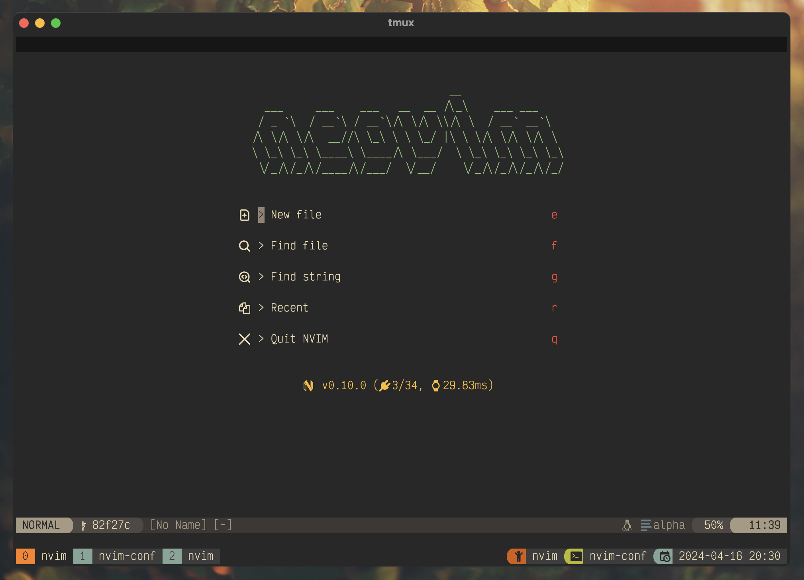

# Nvim Config



This is my neovim config.
This config suits me, feel free to fork and customise this repository.
The main "gimmick" of this config setup is the "lang" files found in `nvim/lua/core/langs`.
These "lang" files define the LSP, linters and formatters for each language.

You can extend them by:

1. Adding a language definition file (see `nvim/lua/core/types.lua` for format).
2. Import the language definition file into `nvim/lua/core/langs/init.lua`.
3. Extend the language definitions table to include your newly imported language definition.


## Usage

You can use the built in `install.sh` script to do a fresh install of this config into `~/.config/nvim`.
It is suggested to remove/backup existing config with `mv ~/.config/nvim ~/.config/nvim-bak`.
It is also suggested to remove the existing nvim local cache file where plugins are installed `rm -rf ~/.local/share/nvim`.

```bash
# clean up existing neovim config/cache files
mv ~/.config/nvim ~/.config/nvim-bak
rm -rf ~/.local/share/nvim

# copy the config
./install.sh

# start neovim
nvim
```

When you start neovim you should see the `Lazy` package manager install all of the plugins.
You should then see `Mason` install the required LSP, linters and formatters.
Treesitter will then also install the relevant parsers.
If you close and reopen neovim, you should be greeted with the dashboard.
At this point you are ready to start hacking away!

## Authors

* Patty C. ([schlerp](https://github.com/schlerp))
